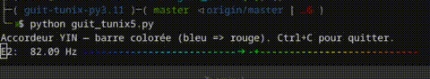

# Guit Tunix

Simple Python guitar tuner

Développé avec l'aide de ChatGPT

utilise la méthode YIN : algorythme de traitement du signal, afin de muter les harmoniques et augmenter la fréquence principale.

Utilisé avec le cable Jack->USB sur la guitare Gibson.

## Install
Dans un venv :

```bash
pip install  -r requirements.txt
```

## Screenshot Demo



## Limitations

Pour l'heure, ne permet d'accorder la guitare qu'en standard E-A-D-G-B-E

