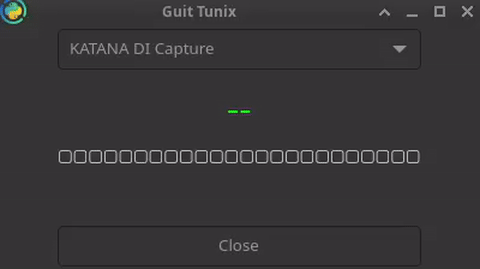

# Guit Tunix

Simple Python3 Gtk4 guitar tuner

With PulseAudio source selector (Mic/USB/...)

Noise reduction, so you can tune Classic Guitars with a microphone

## Requirements

> gi threading numpy ruamel.yaml pulsectl

## Demo



## Configuration

[config.yaml](./config.yaml) :  add here wanted Notes: Frequencies
```yaml
TARGET_FREQS:
    E₂: 82.41
    A₂: 110.00
    D₃: 146.83
    G₃: 196.00
    B₃: 246.94
    E₄: 329.63

```

